# CIM Domain Component Architecture

## Overview

This document provides a visual representation of the current component architecture in the cim-domain module, showing how all the pieces fit together to implement our event-driven, domain-driven design.

## Component Architecture Diagram

```mermaid
graph TB
    %% Core DDD Components
    subgraph "Core DDD Building Blocks"
        Component["Component<br/>trait Component"]
        Entity["Entity<br/>trait Entity<br/>+ EntityId"]
        AggregateRoot["AggregateRoot<br/>trait AggregateRoot"]
        ValueObject["Value Objects<br/>(immutable)"]
        StateMachine["StateMachine<T><br/>+ transitions"]
    end

    %% CQRS Components
    subgraph "CQRS Pattern"
        Command["Command<br/>trait Command"]
        Query["Query<br/>trait Query"]
        CommandHandler["CommandHandler<br/>processes commands"]
        QueryHandler["QueryHandler<br/>processes queries"]
        CommandAck["CommandAcknowledgment<br/>(status only)"]
        QueryResult["QueryResult<T><br/>(direct data)"]
        EventStream["EventStreamSubscription<br/>for async results"]
    end

    %% Command & Query Infrastructure
    subgraph "Command/Query Infrastructure"
        EventPublisher["EventPublisher<br/>trait for publishing events"]
        AggregateRepository["AggregateRepository<br/>trait for persistence"]
        ReadModelStorage["ReadModelStorage<br/>trait for read models"]
        InMemoryRepository["InMemoryRepository<br/>(testing)"]
        InMemoryReadModel["InMemoryReadModel<br/>(testing)"]
    end

    %% Event System
    subgraph "Event System"
        DomainEvent["DomainEvent<br/>trait + metadata"]
        EventEnvelope["DomainEventEnvelope<br/>+ subject + metadata"]
        EventMetadata["EventMetadata<br/>+ correlation/causation"]
        PropagationScope["PropagationScope<br/>Local/Cluster/Global"]
        DomainEventEnum["DomainEventEnum<br/>wrapper for all events"]
    end

    %% Subject-Based Routing
    subgraph "Subject Routing"
        SubjectParts["SubjectParts<br/>context.entity.event.version"]
        SubjectPattern["SubjectPattern<br/>with wildcards"]
        SubjectParser["SubjectParser<br/>trait"]
        MessageTranslator["MessageTranslator<br/>trait"]
    end

    %% Core Domain Aggregates
    subgraph "Core Aggregates (7)"
        Person["Person<br/>PersonRegistered<br/>RegisterPerson"]
        Organization["Organization<br/>OrganizationCreated<br/>CreateOrganization"]
        Agent["Agent<br/>AgentDeployed<br/>DeployAgent"]
        Location["Location<br/>LocationDefined<br/>DefineLocation"]
        Policy["Policy<br/>PolicyEnacted<br/>EnactPolicy"]
        Document["Document<br/>DocumentUploaded<br/>UploadDocument"]
        Workflow["Workflow<br/>WorkflowStarted<br/>StartWorkflow"]
    end

    %% Command Handlers
    subgraph "Command Handlers"
        PersonCmdHandler["PersonCommandHandler"]
        OrgCmdHandler["OrganizationCommandHandler"]
        AgentCmdHandler["AgentCommandHandler"]
        LocationCmdHandler["LocationCommandHandler"]
        PolicyCmdHandler["PolicyCommandHandler"]
        DocumentCmdHandler["DocumentCommandHandler"]
        WorkflowCmdHandler["WorkflowCommandHandler"]
    end

    %% Query Handlers & Views
    subgraph "Query Handlers & Views"
        PersonQueryHandler["PersonQueryHandler<br/>+ PersonView"]
        OrgQueryHandler["OrganizationQueryHandler<br/>+ OrganizationView"]
        AgentQueryHandler["AgentQueryHandler<br/>+ AgentView"]
        LocationQueryHandler["LocationQueryHandler<br/>+ LocationView"]
        PolicyQueryHandler["PolicyQueryHandler<br/>+ PolicyView"]
        DocumentQueryHandler["DocumentQueryHandler<br/>+ DocumentView"]
        WorkflowQueryHandler["WorkflowQueryHandler<br/>+ WorkflowView"]
    end

    %% Workflow System
    subgraph "Workflow System"
        WorkflowState["WorkflowState<br/>trait"]
        WorkflowTransition["WorkflowTransition<br/>trait"]
        WorkflowCategory["WorkflowCategory<br/>composition"]
        TransitionInput["TransitionInput<br/>trait"]
        TransitionOutput["TransitionOutput<br/>trait"]
        WorkflowAggregate["WorkflowAggregate<br/>running instances"]
    end

    %% Bevy Bridge
    subgraph "Bevy ECS Bridge"
        BevyCommand["BevyCommand<br/>SpawnEntity<br/>UpdateEntity<br/>DespawnEntity"]
        BevyEvent["BevyEvent<br/>EntitySelected<br/>EntityMoved<br/>CreationRequested"]
        ComponentData["ComponentData<br/>type + JSON data"]
        NatsToBevyTranslator["NatsToBevyTranslator<br/>NATS → Bevy"]
        BevyEventRouter["BevyEventRouter<br/>Bevy → NATS"]
    end

    %% Type System
    subgraph "Type System"
        NodeType["NodeType<br/>enum"]
        RelationshipType["RelationshipType<br/>enum"]
        ContextType["ContextType<br/>enum"]
        CompositionType["CompositionType<br/>enum"]
        IdType["IdType<br/>Uuid | Cid"]
    end

    %% Identifiers
    subgraph "Identifiers"
        NodeId["NodeId"]
        EdgeId["EdgeId"]
        GraphId["GraphId"]
        WorkflowId["WorkflowId"]
        StateId["StateId"]
        TransitionId["TransitionId"]
        CorrelationId["CorrelationId<br/>→ IdType"]
        CausationId["CausationId<br/>→ IdType"]
    end

    %% Relationships
    Entity --> Component
    Entity --> AggregateRoot
    AggregateRoot --> Entity

    Command --> CommandHandler
    CommandHandler --> CommandAck
    CommandHandler --> EventPublisher
    CommandHandler --> AggregateRepository

    Query --> QueryHandler
    QueryHandler --> QueryResult
    QueryHandler --> ReadModelStorage

    CommandAck -.-> EventStream

    EventPublisher --> DomainEventEnum
    DomainEventEnum --> DomainEvent
    DomainEvent --> EventEnvelope
    EventEnvelope --> EventMetadata
    EventMetadata --> CorrelationId
    EventMetadata --> CausationId
    EventMetadata --> PropagationScope

    EventEnvelope --> SubjectParts
    SubjectParts --> SubjectPattern
    SubjectParser --> SubjectParts

    Person --> PersonCmdHandler
    Organization --> OrgCmdHandler
    Agent --> AgentCmdHandler
    Location --> LocationCmdHandler
    Policy --> PolicyCmdHandler
    Document --> DocumentCmdHandler
    Workflow --> WorkflowCmdHandler

    PersonCmdHandler --> PersonQueryHandler
    OrgCmdHandler --> OrgQueryHandler
    AgentCmdHandler --> AgentQueryHandler
    LocationCmdHandler --> LocationQueryHandler
    PolicyCmdHandler --> PolicyQueryHandler
    DocumentCmdHandler --> DocumentQueryHandler
    WorkflowCmdHandler --> WorkflowQueryHandler

    WorkflowAggregate --> WorkflowState
    WorkflowAggregate --> WorkflowTransition
    WorkflowTransition --> TransitionInput
    WorkflowTransition --> TransitionOutput
    WorkflowCategory --> WorkflowTransition

    NatsToBevyTranslator --> MessageTranslator
    NatsToBevyTranslator --> BevyCommand
    BevyEventRouter --> BevyEvent
    BevyEvent --> SubjectPattern

    ComponentData --> BevyCommand
    EventEnvelope -.-> NatsToBevyTranslator
    BevyEvent -.-> BevyEventRouter

    StateMachine --> Entity

    InMemoryRepository --> AggregateRepository
    InMemoryReadModel --> ReadModelStorage

    %% Styling
    classDef core fill:#e1f5fe,stroke:#01579b,stroke-width:2px
    classDef cqrs fill:#f3e5f5,stroke:#4a148c,stroke-width:2px
    classDef event fill:#fff3e0,stroke:#e65100,stroke-width:2px
    classDef entity fill:#e8f5e9,stroke:#1b5e20,stroke-width:2px
    classDef handler fill:#e0f2f1,stroke:#004d40,stroke-width:2px
    classDef bevy fill:#fce4ec,stroke:#880e4f,stroke-width:2px
    classDef type fill:#f5f5f5,stroke:#424242,stroke-width:2px
    classDef workflow fill:#e8eaf6,stroke:#283593,stroke-width:2px
    classDef infra fill:#fff8e1,stroke:#f57f17,stroke-width:2px

    class Component,Entity,AggregateRoot,ValueObject,StateMachine core
    class Command,Query,CommandHandler,QueryHandler,CommandAck,QueryResult,EventStream cqrs
    class DomainEvent,EventEnvelope,EventMetadata,PropagationScope,DomainEventEnum event
    class Person,Organization,Agent,Location,Policy,Document,Workflow entity
    class PersonCmdHandler,OrgCmdHandler,AgentCmdHandler,LocationCmdHandler,PolicyCmdHandler,DocumentCmdHandler,WorkflowCmdHandler handler
    class PersonQueryHandler,OrgQueryHandler,AgentQueryHandler,LocationQueryHandler,PolicyQueryHandler,DocumentQueryHandler,WorkflowQueryHandler handler
    class BevyCommand,BevyEvent,ComponentData,NatsToBevyTranslator,BevyEventRouter bevy
    class NodeType,RelationshipType,ContextType,CompositionType,IdType,NodeId,EdgeId,GraphId,WorkflowId,StateId,TransitionId,CorrelationId,CausationId type
    class WorkflowState,WorkflowTransition,WorkflowCategory,TransitionInput,TransitionOutput,WorkflowAggregate workflow
    class EventPublisher,AggregateRepository,ReadModelStorage,InMemoryRepository,InMemoryReadModel infra
```



## Component Categories

### 1. Core DDD Building Blocks (Blue)
- **Component**: Base trait for attachable components with type erasure
- **Entity**: Types with identity and lifecycle
- **AggregateRoot**: Consistency boundaries with root entities
- **ValueObject**: Immutable types defined by their attributes
- **StateMachine**: Generic state machine with transition history

### 2. CQRS Pattern (Purple)
- **Command/Query**: Requests that return only acknowledgments or direct data
- **CommandHandler/QueryHandler**: Process commands and queries
- **CommandAck**: Status-only responses for commands (Accepted/Rejected)
- **QueryResult<T>**: Direct data responses for queries
- **EventStreamSubscription**: For receiving async results from commands

### 3. Command/Query Infrastructure (Yellow)
- **EventPublisher**: Trait for publishing domain events after command processing
- **AggregateRepository**: Trait for loading and saving aggregates
- **ReadModelStorage**: Trait for persisting and querying read models
- **InMemoryRepository**: Testing implementation of repository
- **InMemoryReadModel**: Testing implementation of read model storage

### 4. Event System (Orange)
- **DomainEvent**: Base trait for all domain events
- **DomainEventEnum**: Wrapper enum containing all domain events
- **EventEnvelope**: Wraps events with metadata and subjects
- **EventMetadata**: Correlation, causation, and propagation info
- **PropagationScope**: Controls event propagation (Local/Cluster/Global)

### 5. Subject-Based Routing
- **SubjectParts**: Parsed components of NATS subjects
- **SubjectPattern**: Pattern matching with wildcards
- **SubjectParser**: Trait for parsing subjects
- **MessageTranslator**: Bidirectional translation trait

### 6. Core Domain Aggregates (Green)
Seven essential aggregates for CIM implementation:
- **Person**: Individual users with events like PersonRegistered
- **Organization**: Groups/companies with OrganizationCreated
- **Agent**: AI/automated entities with AgentDeployed
- **Location**: Physical/logical locations with LocationDefined
- **Policy**: Rules/permissions with PolicyEnacted
- **Document**: Files/content with DocumentUploaded
- **Workflow**: Business processes with WorkflowStarted

### 7. Command Handlers (Teal)
Dedicated handlers for each aggregate:
- Process commands and emit domain events
- Use EventPublisher to publish events
- Use AggregateRepository for persistence
- Return only acknowledgments (success/failure)

### 8. Query Handlers & Views (Teal)
Query processing and view models:
- Each aggregate has a corresponding view model
- Query handlers return data directly (not through events)
- Support various query types (by ID, by criteria, list all)
- Use ReadModelStorage for querying projections

### 9. Workflow System (Indigo)
Category theory-based workflow implementation:
- **WorkflowState**: Trait for workflow states
- **WorkflowTransition**: Trait for state transitions
- **WorkflowCategory**: Composition of transitions
- **TransitionInput/Output**: Data for transitions
- **WorkflowAggregate**: Running workflow instances

### 10. Bevy ECS Bridge (Pink)
- **BevyCommand**: ECS operations (SpawnEntity, UpdateEntity, etc.)
- **BevyEvent**: UI interactions (EntitySelected, EntityMoved, etc.)
- **ComponentData**: Generic component representation
- **Translators**: Convert between NATS events and Bevy commands

### 11. Type System (Gray)
- **NodeType**: Types of graph nodes
- **RelationshipType**: Types of edges/relationships
- **ContextType**: Bounded context types
- **CompositionType**: How components compose
- **Identifiers**: Various ID types (NodeId, EdgeId, WorkflowId, etc.)

## Key Design Patterns

### Event-Driven Architecture
- Commands return acknowledgments only
- Queries return data directly (synchronous)
- Async results delivered through event streams
- Correlation IDs link requests to responses

### Subject-Based Routing
```
context.entity.event.version
Example: people.person.registered.v1
```

### Immutable Value Objects
- Value objects are never "updated"
- Always removed and re-added with new values
- Maintains event sourcing integrity

### State Machine Pattern
- Enums restrict valid states
- Transitions tracked with history
- Required for aggregates and known procedures

### Repository Pattern
- Aggregates loaded through repository
- Changes persisted through repository
- Enables different storage backends

## Implementation Status

| Component Group | Status | Description |
|----------------|--------|-------------|
| Core DDD | ✅ Complete | All base traits implemented |
| CQRS | ✅ Complete | Commands and queries with proper separation |
| Command Handlers | ✅ Complete | All 7 aggregates have command handlers |
| Query Handlers | ✅ Complete | All aggregates have query handlers and views |
| Event System | ✅ Complete | Full metadata and routing support |
| Subject Routing | ✅ Complete | NATS subject parsing and patterns |
| Core Aggregates | ✅ Complete | All 7 aggregates with events/commands |
| Workflow System | ✅ Complete | Category theory-based workflows |
| Bevy Bridge | ✅ Complete | Bidirectional translation working |
| Type System | ✅ Complete | All identifier and enum types defined |
| Infrastructure | ✅ Complete | Repository and read model traits |

## Test Coverage

Current test count: **192 tests** (all passing)
- Command Handlers: 3 tests
- Query Handlers: 6 tests
- Workflow System: 18 tests
- All other components fully tested

## Next Steps

1. **Event Store Integration**: Implement NATS JetStream persistence
2. **Persistent Storage**: Add database backends for repositories
3. **Saga Orchestration**: Cross-aggregate workflows
4. **Integration Tests**: Full NATS + Bevy integration testing
5. **Performance Optimization**: Caching and batching strategies
