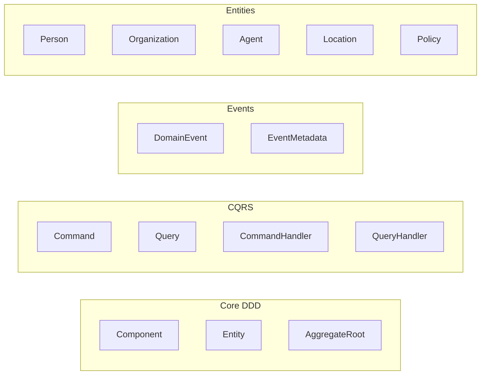

# cim-domain Component Reference

**Version**: 0.1.0

**Description**: Core DDD components and traits for CIM

## Table of Contents

1. [Component Overview](#component-overview)
2. [Core Entities](#core-entities)
3. [Module Reference](#module-reference)
4. [Statistics](#statistics)
5. [Type Index](#type-index)

## Component Overview

## Core Entities

### Person

Individual users in the system

**Events**:
- `PersonRegistered`

**Commands**:
- `RegisterPerson`
- `UpdatePersonProfile`

### Organization

Groups, companies, or teams

**Events**:
- `OrganizationCreated`

**Commands**:
- `CreateOrganization`
- `AddOrganizationMember`

### Agent

AI or automated entities

**Events**:
- `AgentDeployed`

**Commands**:
- `DeployAgent`
- `UpdateAgentCapabilities`

### Location

Physical or logical locations

**Events**:
- `LocationDefined`

**Commands**:
- `DefineLocation`

### Policy

Rules and permissions

**Events**:
- `PolicyEnacted`

**Commands**:
- `EnactPolicy`
- `UpdatePolicyRules`

## Module Reference

### bevy_bridge (`bevy_bridge.rs`)

Bevy ECS integration

**Structs**:
- `ComponentData` - Generic component representation
- `ComponentMapper` - Maps domain to ECS
- `NatsMessage` - NATS message wrapper
- `NatsToBevyTranslator` - NATS to Bevy translation
- `BevyEventRouter` - Routes Bevy events to subjects

**Enums**:
- `BevyCommand` - ECS commands (SpawnEntity, UpdateEntity, DespawnEntity, CreateRelationship)
- `BevyEvent` - UI events (EntitySelected, EntityMoved, EntityCreationRequested)
- `TranslationError` - Translation errors

### commands (`commands.rs`)

Domain commands

**Structs**:
- `RegisterPerson` - Register a new person
- `UpdatePersonProfile` - Update person profile
- `CreateOrganization` - Create new organization
- `AddOrganizationMember` - Add member to organization
- `DeployAgent` - Deploy new agent
- `UpdateAgentCapabilities` - Update agent capabilities
- `DefineLocation` - Define new location
- `EnactPolicy` - Enact new policy
- `UpdatePolicyRules` - Update policy rules

### component (`component.rs`)

Base component system

**Traits**:
- `Component` - Base trait for attachable components with type erasure

**Structs**:
- `ComponentStorage` - Storage for type-erased components

### composition_types (`composition_types.rs`)

Composition patterns

**Enums**:
- `CompositionType` - How components compose
- `DomainCompositionType` - Domain-specific composition

### context_types (`context_types.rs`)

DDD context types

**Enums**:
- `ContextType` - Bounded context types
- `SubdomainType` - Subdomain classifications
- `ServiceType` - Service types

### cqrs (`cqrs.rs`)

CQRS pattern implementation

**Traits**:
- `Command` - Command interface - returns only acknowledgments
- `Query` - Query interface - returns only acknowledgments
- `CommandHandler` - Processes commands
- `QueryHandler` - Processes queries

**Structs**:
- `CommandId` - Command identifier
- `QueryId` - Query identifier
- `EventId` - Event identifier
- `CorrelationId` - Correlation tracking
- `CausationId` - Causation tracking
- `CommandEnvelope` - Command with metadata
- `QueryEnvelope` - Query with metadata
- `CommandAcknowledgment` - Command response
- `QueryAcknowledgment` - Query response
- `EventStreamSubscription` - For async results

**Enums**:
- `IdType` - Uuid or Cid variants
- `CommandStatus` - Accepted/Rejected
- `QueryStatus` - Accepted/Rejected

### entity (`entity.rs`)

Entity and aggregate definitions

**Traits**:
- `Entity` - Types with identity and lifecycle
- `AggregateRoot` - Consistency boundary marker

**Structs**:
- `EntityId` - Unique entity identifier
- `GraphMarker` - Phantom type marker for graphs
- `AggregateMarker` - Phantom type marker for aggregates
- `BoundedContextMarker` - Phantom type marker for bounded contexts
- `EntityMarker` - Phantom type marker for entities
- `ValueObjectMarker` - Phantom type marker for value objects
- `ServiceMarker` - Phantom type marker for services
- `EventMarker` - Phantom type marker for events
- `CommandMarker` - Phantom type marker for commands
- `QueryMarker` - Phantom type marker for queries

### errors (`errors.rs`)

Error types

**Enums**:
- `DomainError` - Domain-specific errors

**Type Aliases**:
- `DomainResult<T>` - Result type alias

### events (`events.rs`)

Domain events

**Traits**:
- `DomainEvent` - Base event interface

**Structs**:
- `EventMetadata` - Event metadata
- `DomainEventEnvelope<T>` - Generic event wrapper
- `PersonRegistered` - Person registration event
- `OrganizationCreated` - Organization creation event
- `AgentDeployed` - Agent deployment event
- `LocationDefined` - Location definition event
- `PolicyEnacted` - Policy enactment event

### identifiers (`identifiers.rs`)

Domain identifiers

**Structs**:
- `NodeId` - Graph node identifier
- `EdgeId` - Graph edge identifier
- `GraphId` - Graph identifier

### node_types (`node_types.rs`)

Node type definitions

**Enums**:
- `NodeType` - Types of nodes in graphs

### relationship_types (`relationship_types.rs`)

Relationship type definitions

**Enums**:
- `RelationshipType` - Types of relationships/edges

### state_machine (`state_machine.rs`)

State machine implementation

**Traits**:
- `State` - State interface
- `StateTransitions` - Valid transitions

**Structs**:
- `StateMachine<S>` - Generic state machine
- `StateTransition<S>` - Transition record

**Enums**:
- `OrderState` - Example order states
- `PersonState` - Example person states

### subjects (`subjects.rs`)

NATS subject routing

**Traits**:
- `MessageTranslator` - Translation interface
- `SubjectParser` - Subject parsing

**Structs**:
- `SubjectParts` - Parsed subject components
- `SubjectPattern` - Pattern with wildcards
- `SubjectPermissions` - Access control
- `EventEnvelope` - Event with routing info

**Enums**:
- `PropagationScope` - Local/Cluster/Global

## Statistics

| Type | Count |
|------|-------|
| Traits | 11 |
| Enums | 15 |
| Structs | 35 |
| Type Aliases | 1 |
| Core Entities | 5 |
| Event Types | 5 |
| Command Types | 9 |
| **Total Public Types** | **66** |

## Type Index

All public types in alphabetical order:

- `AddOrganizationMember` (struct) - [commands](#commands)
- `AgentDeployed` (struct) - [events](#events)
- `AggregateMarker` (struct) - [entity](#entity)
- `AggregateRoot` (trait) - [entity](#entity)
- `BevyCommand` (enum) - [bevy_bridge](#bevy_bridge)
- `BevyEvent` (enum) - [bevy_bridge](#bevy_bridge)
- `BevyEventRouter` (struct) - [bevy_bridge](#bevy_bridge)
- `BoundedContextMarker` (struct) - [entity](#entity)
- `CausationId` (struct) - [cqrs](#cqrs)
- `Command` (trait) - [cqrs](#cqrs)
- `CommandAcknowledgment` (struct) - [cqrs](#cqrs)
- `CommandEnvelope` (struct) - [cqrs](#cqrs)
- `CommandHandler` (trait) - [cqrs](#cqrs)
- `CommandId` (struct) - [cqrs](#cqrs)
- `CommandMarker` (struct) - [entity](#entity)
- `CommandStatus` (enum) - [cqrs](#cqrs)
- `Component` (trait) - [component](#component)
- `ComponentData` (struct) - [bevy_bridge](#bevy_bridge)
- `ComponentMapper` (struct) - [bevy_bridge](#bevy_bridge)
- `ComponentStorage` (struct) - [component](#component)
- `CompositionType` (enum) - [composition_types](#composition_types)
- `ContextType` (enum) - [context_types](#context_types)
- `CorrelationId` (struct) - [cqrs](#cqrs)
- `CreateOrganization` (struct) - [commands](#commands)
- `DefineLocation` (struct) - [commands](#commands)
- `DeployAgent` (struct) - [commands](#commands)
- `DomainCompositionType` (enum) - [composition_types](#composition_types)
- `DomainError` (enum) - [errors](#errors)
- `DomainEvent` (trait) - [events](#events)
- `DomainEventEnvelope` (struct) - [events](#events)
- `DomainResult` (type_alias) - [errors](#errors)
- `EdgeId` (struct) - [identifiers](#identifiers)
- `EnactPolicy` (struct) - [commands](#commands)
- `Entity` (trait) - [entity](#entity)
- `EntityId` (struct) - [entity](#entity)
- `EntityMarker` (struct) - [entity](#entity)
- `EventEnvelope` (struct) - [subjects](#subjects)
- `EventId` (struct) - [cqrs](#cqrs)
- `EventMarker` (struct) - [entity](#entity)
- `EventMetadata` (struct) - [events](#events)
- `EventStreamSubscription` (struct) - [cqrs](#cqrs)
- `GraphId` (struct) - [identifiers](#identifiers)
- `GraphMarker` (struct) - [entity](#entity)
- `IdType` (enum) - [cqrs](#cqrs)
- `LocationDefined` (struct) - [events](#events)
- `MessageTranslator` (trait) - [subjects](#subjects)
- `NatsMessage` (struct) - [bevy_bridge](#bevy_bridge)
- `NatsToBevyTranslator` (struct) - [bevy_bridge](#bevy_bridge)
- `NodeId` (struct) - [identifiers](#identifiers)
- `NodeType` (enum) - [node_types](#node_types)
- `OrderState` (enum) - [state_machine](#state_machine)
- `OrganizationCreated` (struct) - [events](#events)
- `PersonRegistered` (struct) - [events](#events)
- `PersonState` (enum) - [state_machine](#state_machine)
- `PolicyEnacted` (struct) - [events](#events)
- `PropagationScope` (enum) - [subjects](#subjects)
- `Query` (trait) - [cqrs](#cqrs)
- `QueryAcknowledgment` (struct) - [cqrs](#cqrs)
- `QueryEnvelope` (struct) - [cqrs](#cqrs)
- `QueryHandler` (trait) - [cqrs](#cqrs)
- `QueryId` (struct) - [cqrs](#cqrs)
- `QueryMarker` (struct) - [entity](#entity)
- `QueryStatus` (enum) - [cqrs](#cqrs)
- `RegisterPerson` (struct) - [commands](#commands)
- `RelationshipType` (enum) - [relationship_types](#relationship_types)
- `ServiceMarker` (struct) - [entity](#entity)
- `ServiceType` (enum) - [context_types](#context_types)
- `State` (trait) - [state_machine](#state_machine)
- `StateMachine` (struct) - [state_machine](#state_machine)
- `StateTransition` (struct) - [state_machine](#state_machine)
- `StateTransitions` (trait) - [state_machine](#state_machine)
- `SubdomainType` (enum) - [context_types](#context_types)
- `SubjectParser` (trait) - [subjects](#subjects)
- `SubjectParts` (struct) - [subjects](#subjects)
- `SubjectPattern` (struct) - [subjects](#subjects)
- `SubjectPermissions` (struct) - [subjects](#subjects)
- `TranslationError` (enum) - [bevy_bridge](#bevy_bridge)
- `UpdateAgentCapabilities` (struct) - [commands](#commands)
- `UpdatePersonProfile` (struct) - [commands](#commands)
- `UpdatePolicyRules` (struct) - [commands](#commands)
- `ValueObjectMarker` (struct) - [entity](#entity)
