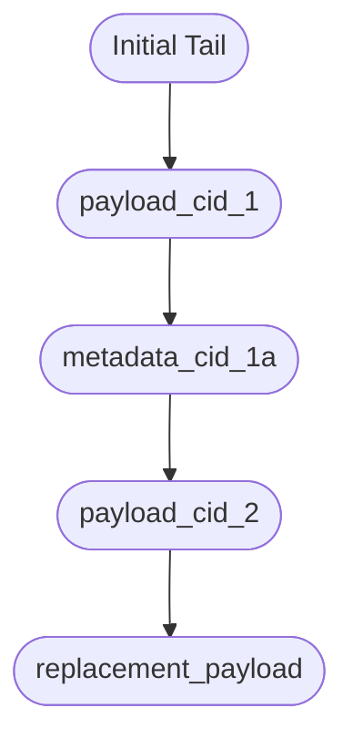

# CIM Domain Persistence Model – Implementation Notes for cim-ipld

*Last updated: $(date -I)*

> **Note:** Whenever we call CIDs an "identity" below, read it as "lookup key". They are not the identity morphisms in the categorical sense; they simply name content so we can retrieve it. All category-theoretic identity laws continue to live at the domain layer (commands, events, aggregates, etc.).

---

## 0. Systems Overview

```mermaid
direction LR
subgraph EventStore
    EV(Event)
end
subgraph KV[KV Index]
    I[(Index Entry)]
end
subgraph OBJ[Object Store]
    B[(Bucket)]
end
EV -->|store payload/metadata| B
EV -->|update| I
B -->|lookup| I
```

- **Event Store (JetStream)** is the source of truth for every domain event.
- **Object Store** holds payload/metadata CIDs in append-only buckets partitioned by aggregate or concept.
- **KV Index** is a derived map (CID → bucket/location/relationships). It can be rebuilt entirely from the event log plus bucket contents.

---

## 1. Event Store Responsibilities

Every event written to the Event Store must include enough information to reconstruct relationships and bucket placement:

| Field | Description |
|-------|-------------|
| `event_id` | UUID v7 generated by domain code. |
| `payload_cid` | CID of the payload extracted and persisted to the object store. |
| `metadata_cids` | Optional list of metadata CIDs appended in the same transaction. |
| `aggregate_id` / `concept_id` | Root ID (domain aggregate or concept). |
| `subject_key` | Subject algebra handle (if supplied or derived). |
| `bucket_id` | Target bucket identifier derived from the root/subject. |
| `correlation_id` / `causation_id` | As established in Priority 1 (command/query/event identities). |
| `move_info` | For move events: from_bucket → to_bucket. |

Event moves (payload relocated to a new bucket) **must** be explicit events so the index can replay them.

---

## 2. Object Store (Buckets)

### 2.1 Partitioning

- Buckets are partitioned by aggregate root or concept ID (e.g., `aggregate:<uuid>` or `concept:<uuid>`).

### 2.2 Append-Only Entries

Each write produces a bucket record:

```json
{
  "cid": "<DomainCid>",
  "previous_tail": "<DomainCid or null>",
  "timestamp": "<optional>"
}
```

- Payload CIDs get appended first.
- Metadata CIDs are separate records, each referencing the payload CID they belong to.
- Replacement payloads append in the same bucket and note their parent payload CID in the KV index (not stored in the bucket entry itself).

### 2.3 Moves

- Moving a CID between buckets is represented by a move event.
- Apply the move by appending the payload CID to the **destination** bucket, treating it as the new tail.
- Optionally record a tombstone in the source bucket (policy dependent); the event log remains the source of truth for the move.

---

## 3. KV Index (Derived Relationships)

### 3.1 Entry Shape

Each CID (payload, metadata, replacement) gets an index entry such as:

```json
{
  "cid": "<DomainCid>",
  "bucket_id": "<BucketID>",
  "root_kind": "aggregate" | "concept",
  "root_id": "<AggregateID or ConceptID>",
  "subject_key": "<Subject|null>",
  "payload_parent": "<PayloadCid|null>",
  "replacement_for": "<PayloadCid|null>",
  "sequence_index": 42,
  "move_history": [
    { "event_id": "...", "from_bucket": "...", "to_bucket": "..." }
  ]
}
```

- `sequence_index` or timestamp ensures we can rebuild the bucket order without replaying the entire bucket DAG.
- `payload_parent` ties metadata/replacement records back to their payload CID.
- Moves append to `move_history` and update `bucket_id`.

### 3.2 Rebuild Process

1. Replay the Event Store in chronological order.
2. For each event:
   - Ensure payload + metadata CIDs exist in the object store (write if missing).
   - Append the CID to the bucket (update tail).
   - Update the KV entry as above.
3. Moves are handled as normal events: update the bucket tail and mark the move in `move_history`.

Because payload CIDs are immutable and buckets are append-only, the rebuild is deterministic.

---

## 4. Subject Algebra Readiness

Even if subjects aren’t fully in use today, capture the data needed to lift them later:

- `root_kind` / `root_id` differentiate aggregate vs concept buckets.
- `subject_key` records the algebra handle (if supplied/derived). If missing, derive from the payload and record the derived value.
- Concept buckets may reference supporting domain objects; tracking those relationships is a matter of storing the concept ID + any quality dimension metadata in the KV entry.

---

## 5. Relationship Diagrams

### 5.1 Event → Payload → Metadata Flow


- The Event Store determines the payload CID and any metadata CIDs.
- The bucket append just records the sequence (no semantics).
- The KV entry ties everything together (payload parent, replacements, move history).

### 5.2 Bucket Chain (Append-Only)



Sequence is preserved by appending each CID and recording the new tail.

---

## 6. Implementation Checklist for cim-ipld

1. **Event ingestion**
   - Generate payload CID, write payload & metadata to object store buckets.
   - Update KV index with bucket ID, root kind/id, subject, parent payload, etc.

2. **Move events**
   - Append payload CID to destination bucket (new tail).
   - Update KV entry with new bucket ID + move history record.

3. **Rebuild tooling**
   - Provide a job/script to replay the event log, regenerate bucket tails, and recompute KV entries.

4. **Query utilities**
   - Expose APIs or functions that use the KV index to fetch payload metadata, replacements, per-bucket sequences, etc.

5. **Subject algebra compatibility**
   - Ensure every KV entry captures the root kind/id and subject handle so categorical lifting stays intact later.

---

By following this structure, the Event Store remains the single source of truth, the Object Store serves as the append-only ledger keyed by aggregate/concept, and the KV index composes CIDs, locations, and relationships in a way that’s fully rebuildable.

