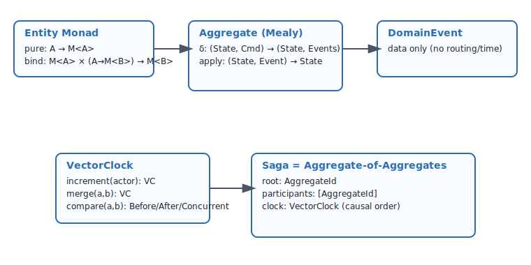
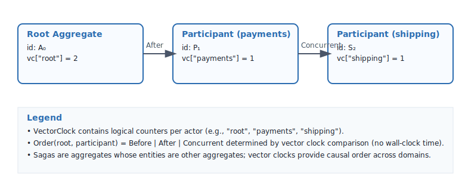

<!-- Copyright (c) 2025 - Cowboy AI, LLC. -->

# String Diagrams for FP Domain Model



## 1. Entity Monad Composition

### Basic Entity Wrapping (pure/return)
```
     A
     |
  [pure]
     |
  Entity<A>
```

### Monadic Bind Operation
```
  Entity<A>      A → Entity<B>
      |              /
      |            /
    [bind]--------'
      |
  Entity<B>
```

### Functor Map
```
  Entity<A>      A → B
      |           /
      |         /
    [map]------'
      |
  Entity<B>
```

## 2. Mealy State Machine Transitions

### Single Step
```
  State × Input
      |   |
      |   |
    [Mealy]
     /    \
   /        \
State'    Output
```

### Chained Transitions
```
S₀ × Cmd₁ → [Mealy] → S₁ × Event₁
                |
                ↓
           S₁ × Cmd₂ → [Mealy] → S₂ × Event₂
                          |
                          ↓
                     S₂ × Cmd₃ → [Mealy] → S₃ × Event₃
```

## 3. Aggregate Command Handling

```
Aggregate × Command
       |      |
       |      |
   [validate]
       |
   [transition]
      / \
     /   \
Aggregate' Events[]
```

Expanded view:
```
    Aggregate(S₀)
         |
    [receive Cmd]
         |
    ╔═══════════╗
    ║  Validate ║
    ╚═════╤═════╝
          |
    ╔═══════════╗
    ║Mealy Trans║
    ╚══╤═════╤══╝
       |     |
  Aggregate  Events
    (S₁)     [E₁,E₂]
```

## 4. Policy Composition

### Sequential Composition
```
Input → [Policy₁] → Intermediate → [Policy₂] → Output
```

### Parallel Application
```
       Input
      /  |  \
     /   |   \
[P₁]   [P₂]   [P₃]
  |      |      |
  ↓      ↓      ↓
 Out₁   Out₂   Out₃
     \   |   /
      [merge]
         |
      Output
```

## 5. Saga (Aggregate-of-Aggregates) with Vector Clocks

Sagas compose aggregates and use Vector Clocks for causal ordering across domains.



```
     Saga(Initial)
          |
    ╔═════════════╗
    ║   Step 1    ║
    ║ Aggregate A ║
    ╚══════╤══════╝
           |
      [Success?]
        /    \
       /      \
   [Yes]      [No]
     |          |
     ↓      [Compensate]
╔═════════════╗    |
║   Step 2    ║    ↓
║ Aggregate B ║  Saga
╚══════╤══════╝ (Failed)
       |
  [Success?]
    /    \
   /      \
[Yes]    [No]
  |        |
  ↓   [Compensate A]
Saga       |
(Done)     ↓
        Saga
       (Failed)
```

## 6. Domain Category Morphisms

### Basic Morphism
```
DomainObject A ----[morphism f]----> DomainObject B
```

### Composed Morphisms
```
A ---[f]---> B ---[g]---> C
      
is equivalent to:

A --------[g∘f]---------> C
```

### Identity Morphism
```
A ---[id_A]---> A
```

## 7. Entity-Component-System Flow

### System as Kleisli Arrow
```
Component₁ → [System] → Entity<Component₂>
```

### System Composition
```
C₁ → [Sys₁] → Entity<C₂> → [>>= Sys₂] → Entity<C₃>

Equivalent to:

C₁ → [Sys₂ ∘ᴷ Sys₁] → Entity<C₃>
```

## 8. Event Sourcing Pattern

```
           Commands
              ↓
    ╔═══════════════════╗
    ║    Aggregate      ║
    ║  (Mealy Machine)  ║
    ╚════════╤══════════╝
             |
          Events
             ↓
    ╔═══════════════════╗
    ║   Event Store     ║
    ╚════════╤══════════╝
             |
         [Replay]
             ↓
    ╔═══════════════════╗
    ║   Projections     ║
    ╚═══════════════════╝
```

## 9. Specification Combinations

### AND Specification
```
     Input
    /      \
   /        \
[Spec₁]  [Spec₂]
   |        |
  Bool₁   Bool₂
    \      /
     [AND]
       |
    Result
```

### OR Specification
```
     Input
    /      \
   /        \
[Spec₁]  [Spec₂]
   |        |
  Bool₁   Bool₂
    \      /
     [OR]
       |
    Result
```

### NOT Specification
```
Input → [Spec] → Bool → [NOT] → Result
```

## 10. Complete Domain Flow

```
    External Request
           |
    ╔══════════════╗
    ║   Command    ║
    ╚══════╤═══════╝
           |
    ╔══════════════╗
    ║   Policy     ║
    ║ (Validation) ║
    ╚══════╤═══════╝
           |
    ╔══════════════╗
    ║  Aggregate   ║
    ║   (Mealy)    ║
    ╚═══╤═════╤════╝
        |     |
   State'  Events
        |     |
        |  ╔══════════╗
        |  ║  Store   ║
        |  ╚══════════╝
        |
    ╔══════════════╗
    ║  Entity<T>   ║
    ║   (Monad)    ║
    ╚══════════════╝
```

## 11. Kleisli Composition in ECS

```
Pure Values          Monadic Values
    A                  Entity<A>
    |                      |
[System₁]                  |
    |                      |
Entity<B> ←--------------bind
    |
[System₂]
    |
Entity<C> ←--------------bind
    |
[System₃]
    |
Entity<D>
```

## 12. Invariant Checking

```
    Domain State
         |
    ╔════════════╗
    ║ Invariant₁ ║──→ ✓/✗
    ╚════════════╝
         |
    ╔════════════╗
    ║ Invariant₂ ║──→ ✓/✗
    ╚════════════╝
         |
    ╔════════════╗
    ║ Invariant₃ ║──→ ✓/✗
    ╚════════════╝
         |
    [All Pass?]
       /    \
      ✓      ✗
      |      |
  [Accept] [Reject]
```

## Summary

These string diagrams visualize:
- **Monadic composition** through Entity
- **State transitions** in Mealy machines
- **Event flow** through aggregates
- **Policy and specification** combinations
- **System composition** in Kleisli category
- **Domain operations** as categorical morphisms

The diagrams show how FP patterns create a composable, type-safe domain model while maintaining mathematical rigor.
