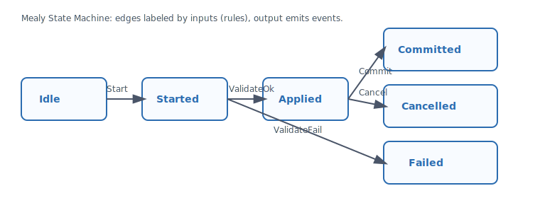

<!-- Copyright 2025 Cowboy AI, LLC. -->

# Transaction State Machine (Mealy) — Graph with Rules

Transactions are Mealy state machines: a graph of states with rule‑guarded transitions. This is not a procedural “step list” — transitions are morphisms, and their legality depends on input and state.

## Model

- States: `Idle → Started → Applied → (Committed | Cancelled | Failed)`
- Inputs: `Start`, `ValidateOk`, `ValidateFail`, `Commit`, `Cancel`
- Output: domain events (produced by transitions)
- Correlation: `AggregateTransactionId` labels the transaction (correlation ID)
- VectorClock: provides causal order across aggregates in a Saga

## Markov Chain View

The state graph defines the only possible transitions (adjacency). A Markov chain over this graph (with optional probabilities for analysis) makes illegal transitions unreachable. We do not attach probabilities in the domain; we use the graph to enforce legality and FP determinism.

## Usage

- Define transaction logic as a Mealy machine (`TransactionState`, `TransactionInput`, `TxOutput`).
- Aggregates originate `AggregateTransactionId` via `AggregateRoot::start_transaction_id()`.
- Correlation IDs inside the transaction equal the transaction id; non‑transactional morphisms use correlation == message_id.

